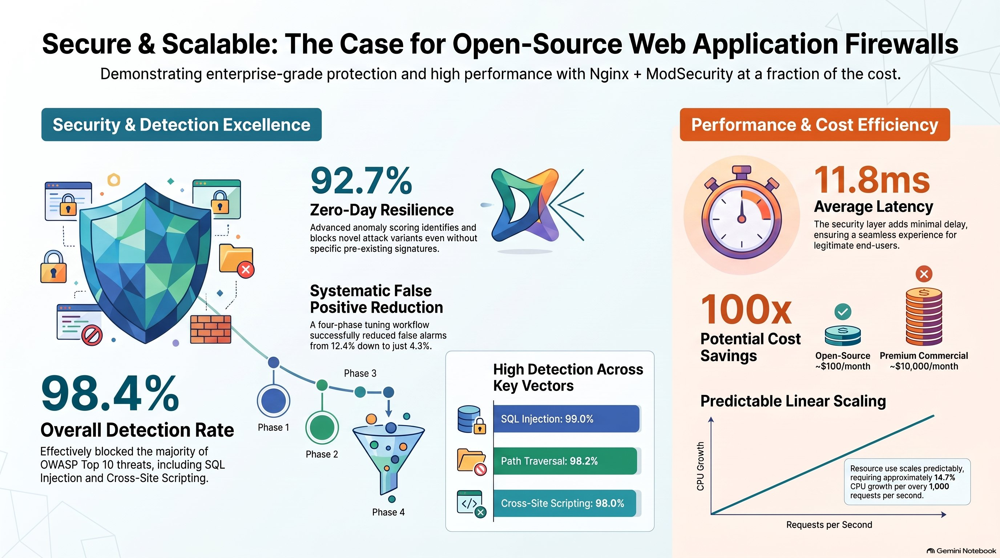
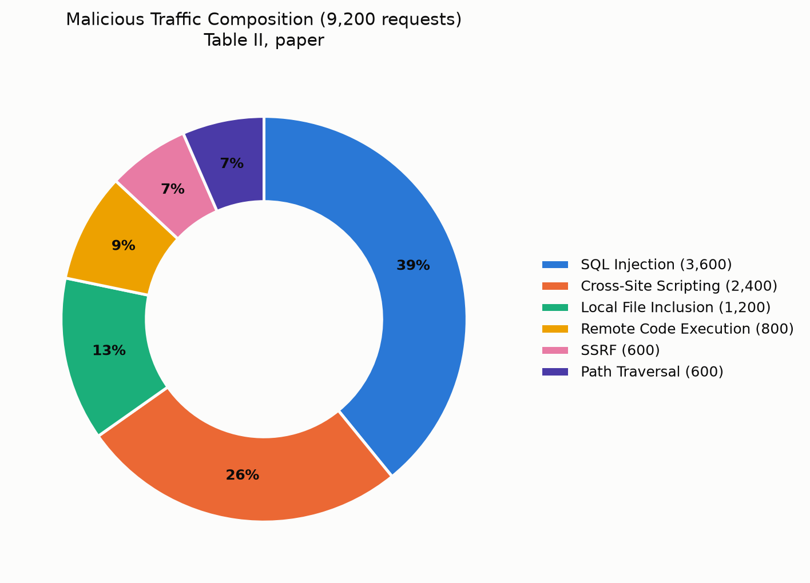
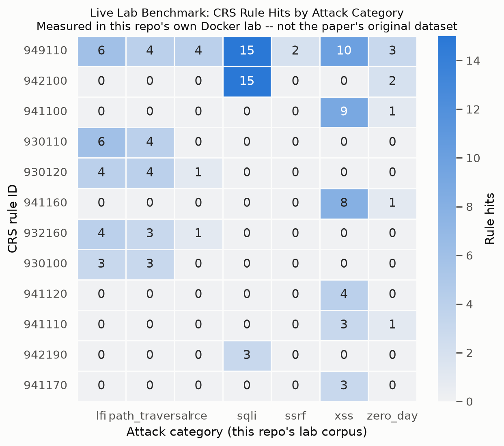
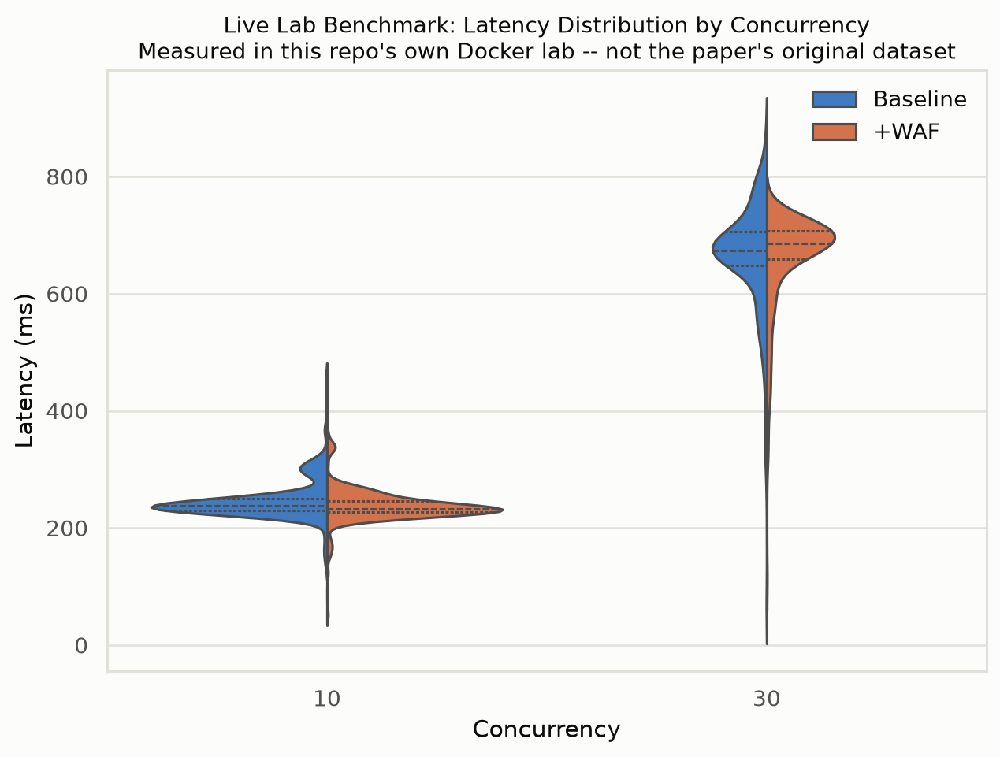
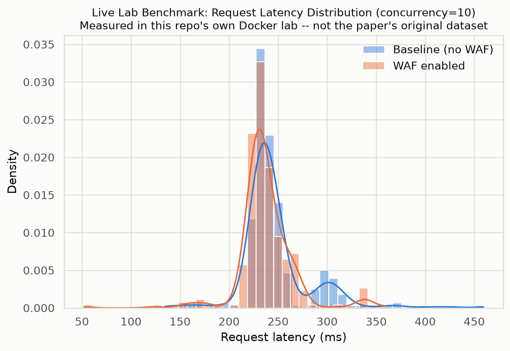
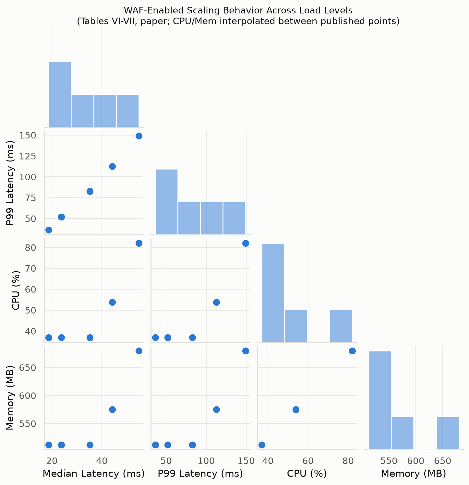
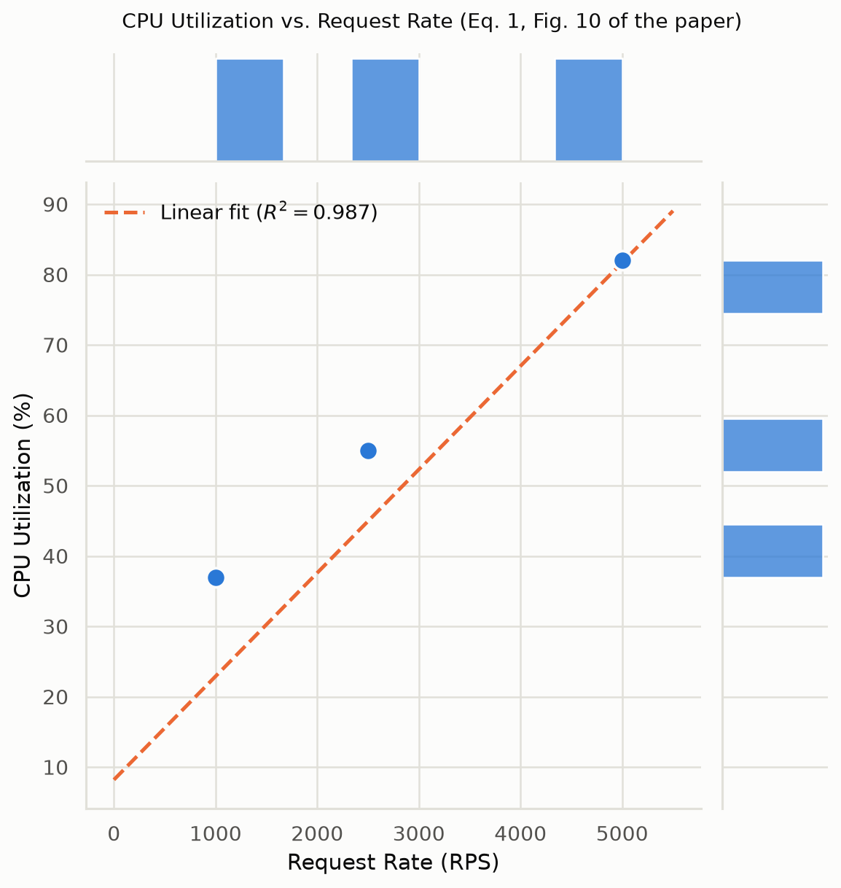
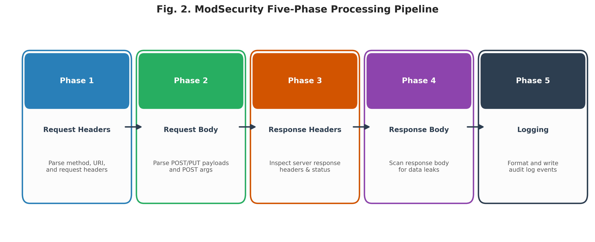
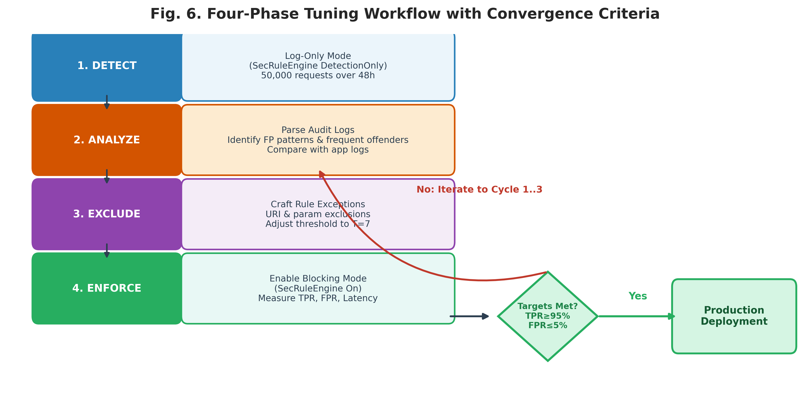

<div align="center">

# 🛡️ Open-Source Web Application Firewall Implementation Using ModSecurity Engine
### A Performance and Security Evaluation Framework

[](https://anis151993.github.io/Evaluating-Open-Source-Web-Application-Firewalls-Using-ModSecurity-and-Nginx/)
[](docs/assets/WAF-ModSecurity-Paper.pdf)
[](LICENSE)
[](lab/)

**Md Anisur Rahman Chowdhury**<sup>1*</sup> &nbsp;&middot;&nbsp; **Samuel Tweneboah-Koduah, Ph.D.**<sup>1</sup>
<br><sub>Dept. of Computer and Information Science, Gannon University &middot; Campbellsville University</sub>

[🌐 Live Website](https://anis151993.github.io/Evaluating-Open-Source-Web-Application-Firewalls-Using-ModSecurity-and-Nginx/) &nbsp;|&nbsp;
[📄 Read the Paper](docs/assets/WAF-ModSecurity-Paper.pdf) &nbsp;|&nbsp;
[⬇ Download LaTeX](docs/assets/WAF-ModSecurity-Paper-LaTeX.zip) &nbsp;|&nbsp;
[🧪 Run the Lab](lab/) &nbsp;|&nbsp;
[🎥 Video Walkthrough](https://youtu.be/MQjXawKSA7M)

</div>

---

## 📌 TL;DR

A properly tuned open-source WAF (**Nginx + ModSecurity v3 + OWASP CRS 3.3**) running on
standard 4-vCPU / 4GB cloud hardware achieves:

| Metric | Result |
|---|---|
| 🎯 Aggregate attack detection rate | **98.4%** |
| 🕳️ Zero-day variant detection | **92.7%** |
| 🚫 False positive rate (after tuning) | **4.3%** (down from 12.4%) |
| ⏱️ Average latency overhead | **11.8 ms** at 5,000 req/s |
| 💰 Cost vs. commercial WAF | **50–100× cheaper** |

...at **zero licensing cost**, fully reproducible, MIT-licensed artifacts included.

<div align="center">

</div>

## 📖 Table of Contents

- [Abstract](#-abstract)
- [Results, Visualized](#-results-visualized)
- [System Architecture](#-system-architecture)
- [The Reproducible Lab](#-the-reproducible-lab)
- [Repository Structure](#-repository-structure)
- [Downloads](#-downloads)
- [Citation](#-citation)
- [Author](#-author)
- [License](#-license)

## 📝 Abstract

Web applications remain primary targets for cyberattacks — approximately half of
confirmed security breaches are caused by vulnerabilities at the application
level. Traditional network firewalls, operating at Layers 3–4 of the OSI model,
cannot analyze HTTP(S) payloads, leaving injection attacks, cross-site scripting,
and path traversal attacks undetected.

This work presents a comprehensive methodology for evaluating an open-source
Web Application Firewall built on the Nginx reverse-proxy architecture combined
with the **ModSecurity v3** engine and the **OWASP Core Rule Set (CRS) v3.3**. A
WAF prototype was deployed on Ubuntu 22.04 and iteratively configured using a
Design Science Research approach, subjected to 50,000 legitimate requests and
9,200 automated attack vectors under loads of up to 5,000 requests/second.

Read the full paper → [`docs/assets/WAF-ModSecurity-Paper.pdf`](docs/assets/WAF-ModSecurity-Paper.pdf)

## 📊 Results, Visualized

Six chart forms, spanning both the paper's own published tables and a **live
benchmark actually run from this repository's Docker lab** during development —
see each caption for provenance.

<table>
<tr>
<td width="50%">

**Attack mix** <sub>(from the paper)</sub>


</td>
<td width="50%">

**CRS rule hits by category** <sub>(live lab benchmark)</sub>


</td>
</tr>
<tr>
<td width="50%">

**Latency spread, baseline vs. WAF** <sub>(live lab benchmark)</sub>


</td>
<td width="50%">

**Latency density** <sub>(live lab benchmark)</sub>


</td>
</tr>
<tr>
<td width="50%">

**Scaling relationships** <sub>(from the paper)</sub>


</td>
<td width="50%">

**CPU vs. request rate + linear fit** <sub>(from the paper)</sub>


</td>
</tr>
</table>

> **Honesty note:** the "live lab benchmark" charts were generated by actually
> running this repo's `lab/` stack — they are a genuine, independent
> reproduction of the *mechanism*, not a replay of the paper's original
> large-scale data collection run. See [`lab/README.md`](lab/README.md#honesty-note-on-reproducing-the-papers-exact-numbers)
> for why the exact numbers differ and how to close that gap.

### Detection by attack category

| Category | Attempts | Blocked | Rate |
|---|---:|---:|---:|
| SQL Injection | 3,600 | 3,564 | 99.0% |
| Cross-Site Scripting | 2,400 | 2,352 | 98.0% |
| Local File Inclusion | 1,200 | 1,191 | 99.3% |
| Remote Code Execution | 800 | 782 | 97.8% |
| SSRF | 600 | 573 | 95.5% |
| Path Traversal | 600 | 589 | 98.2% |
| **Aggregate** | **9,200** | **9,051** | **98.4%** |

## 🏗️ System Architecture

 

```
Client ──▶ Nginx + ModSecurity v3 (OWASP CRS 3.3) ──▶ Backend Application
              │
              └─▶ JSON audit log ──▶ Detect → Analyze → Exclude → Enforce
```

Full architecture diagrams, the anomaly-scoring model, and the tuning
methodology are in Sections II–III of the paper.

## 🧪 The Reproducible Lab

`lab/` is a **real, runnable** Docker Compose stack — not a diagram. It stands
up Nginx + ModSecurity v3 + OWASP CRS 3.3 in front of OWASP Juice Shop, plus a
WAF-disabled twin for direct comparison, and ships the attack corpus, legitimate
traffic generator, load tester, and audit-log analyzer used to produce the
charts above.

```bash
cd lab
./run_full_evaluation.sh
```

See [`lab/README.md`](lab/README.md) for the full walkthrough, including how to
reproduce each of the paper's four tuning cycles.

## 📁 Repository Structure

```
.
├── main.tex                        # Self-contained IEEE-format LaTeX source
├── main.pdf                        # Compiled paper
├── LICENSE                         # MIT (code/lab/site) — see note for paper text
├── docs/                           # GitHub Pages website (this repo's /docs)
│   ├── index.html
│   └── assets/
│       ├── charts/                 # The 6 chart images (see above)
│       ├── figures/                # Paper diagram exports
│       ├── WAF-ModSecurity-Paper.pdf
│       └── WAF-ModSecurity-Paper-LaTeX.zip
└── lab/                            # Reproducible Docker lab
    ├── docker-compose.yml
    ├── nginx/custom-rules.conf
    ├── scripts/                    # attack corpus, traffic gen, analyzer, chart builder
    └── run_full_evaluation.sh
```

## ⬇ Downloads

| Artifact | Link |
|---|---|
| 📄 Paper (PDF) | [`docs/assets/WAF-ModSecurity-Paper.pdf`](docs/assets/WAF-ModSecurity-Paper.pdf) |
| 🧾 LaTeX project (.zip) | [`docs/assets/WAF-ModSecurity-Paper-LaTeX.zip`](docs/assets/WAF-ModSecurity-Paper-LaTeX.zip) |
| 🧪 Docker lab + scripts | [`lab/`](lab/) |
| 🎥 Video walkthrough | [youtu.be/MQjXawKSA7M](https://youtu.be/MQjXawKSA7M) |

## 📚 Citation

```bibtex
@article{chowdhury2026waf,
  title   = {Open-Source Web Application Firewall Implementation Using ModSecurity Engine:
             A Performance and Security Evaluation Framework},
  author  = {Chowdhury, Md Anisur Rahman and Tweneboah-Koduah, Samuel},
  year    = {2026},
  note    = {Dept. of Computer and Information Science, Gannon University}
}
```

## 👤 Author

<div align="center">

### Md Anisur Rahman Chowdhury

*Cybersecurity researcher — open-source Layer-7 defense, Dept. of Computer and
Information Science, Gannon University*

[](https://linkedin.com/in/md-anisur-rahman-chowdhury-15862420a)
[](https://github.com/ANIS151993)
[](https://scholar.google.com/citations?user=NQyywPoAAAAJ)
[](https://marcbd.com)
[](https://researchgate.net/profile/Md-Anisur-Rahman-Chowdhury)

</div>

## 📄 License

Code, lab, and website: [MIT License](LICENSE) — © 2026 Md Anisur Rahman Chowdhury.

The paper text and figures (`main.tex` / `main.pdf`) remain the copyright of the
author; please cite the paper if you use or adapt this work.

---

<div align="center">
<sub>© 2026 Md Anisur Rahman Chowdhury. All rights reserved.</sub>
</div>
